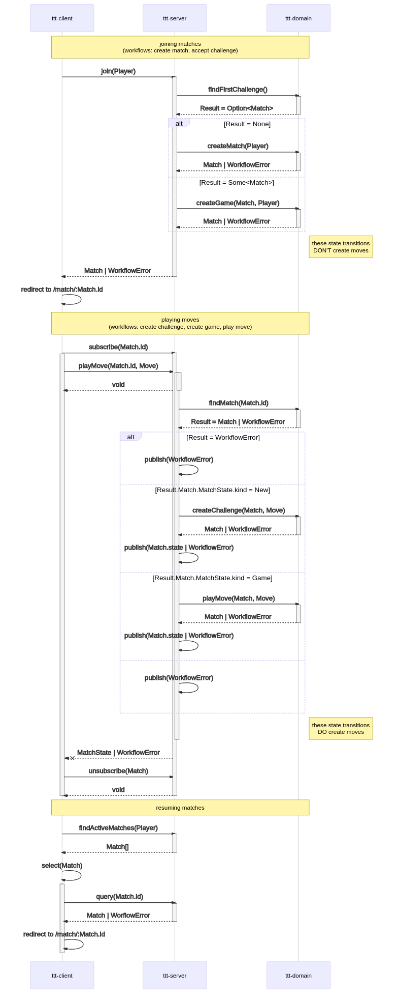

# ttt

## Domain model

- [Domain model](./ttt-domain/src/domain/model.ts)

## Commands

- [Command support](ttt-domain/src/command/support.ts)
- [Global command handler](ttt-domain/src/command/global-command-handler.ts)
- [Join game command handler](ttt-domain/src/command/join-game-command-handler.ts)
- [Play move command handler](ttt-domain/src/command/play-move-command-handler.ts)

## Workflows

- [Workflow support](./ttt-domain/src/workflow/support.ts)
- [Create match](./ttt-domain/src/workflow/create-match.ts)
- [Create game](./ttt-domain/src/workflow/create-game.ts)
- [Create challenge](./ttt-domain/src/workflow/create-challenge.ts)
- [Play move](./ttt-domain/src/workflow/play-move.ts)

## References

- [Harel, David. Statecharts: A visual formalism for complex systems](http://www.inf.ed.ac.uk/teaching/courses/seoc/2004_2005/resources/statecharts.pdf)
- [Wlaschin, Scott. Domain Modelling Made Functional](https://fsharpforfunandprofit.com/books/)
