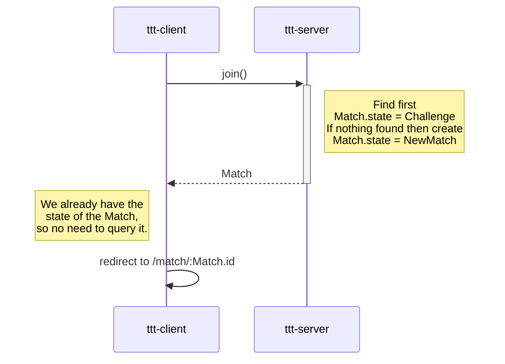
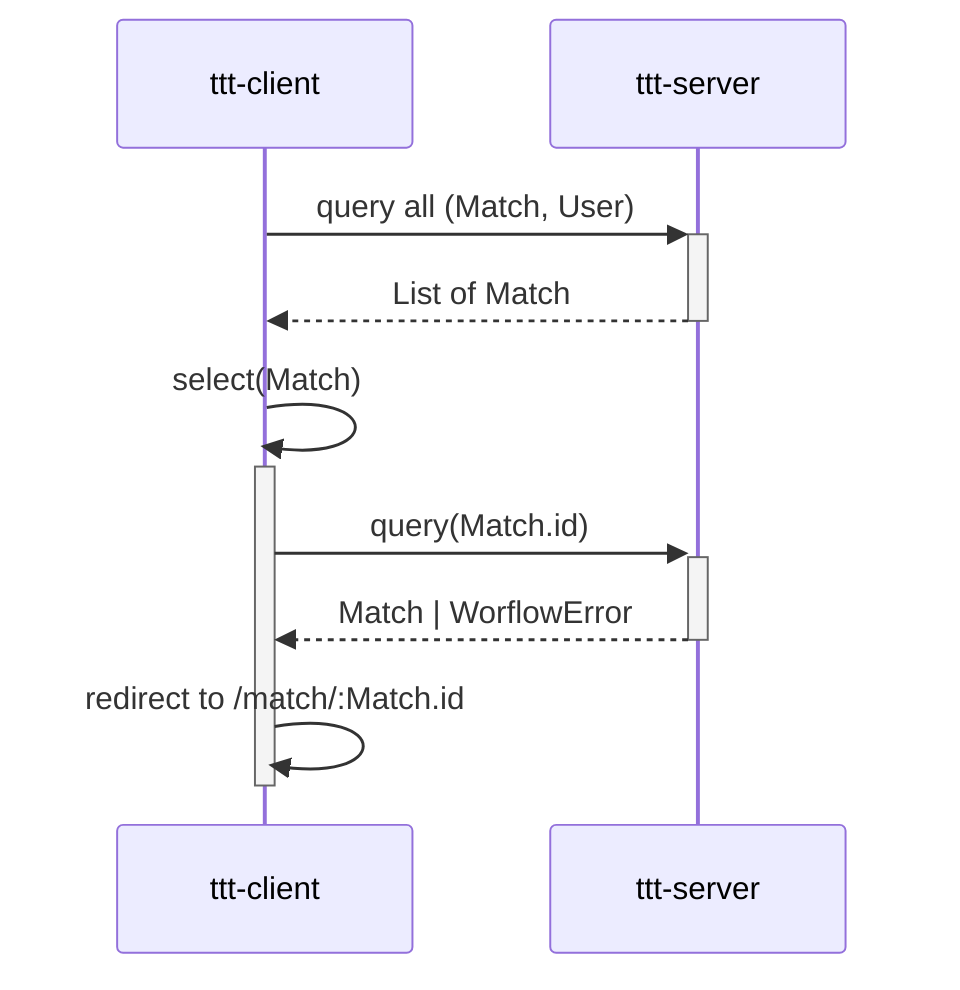
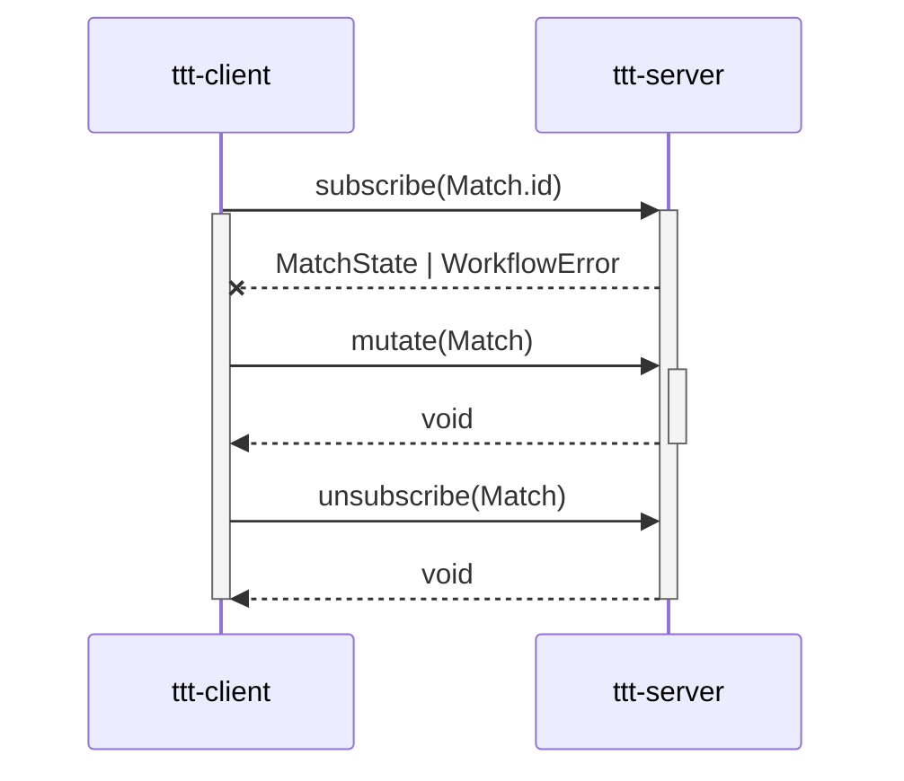

# ttt

## Join a match

## Resume a match

## Gameplay

## References

- [Wlaschin, Scott. Domain Modelling Made Functional](https://fsharpforfunandprofit.com/books/)
- [Harel, David. Statecharts: A visual formalism for complex systems](http://www.inf.ed.ac.uk/teaching/courses/seoc/2004_2005/resources/statecharts.pdf)
