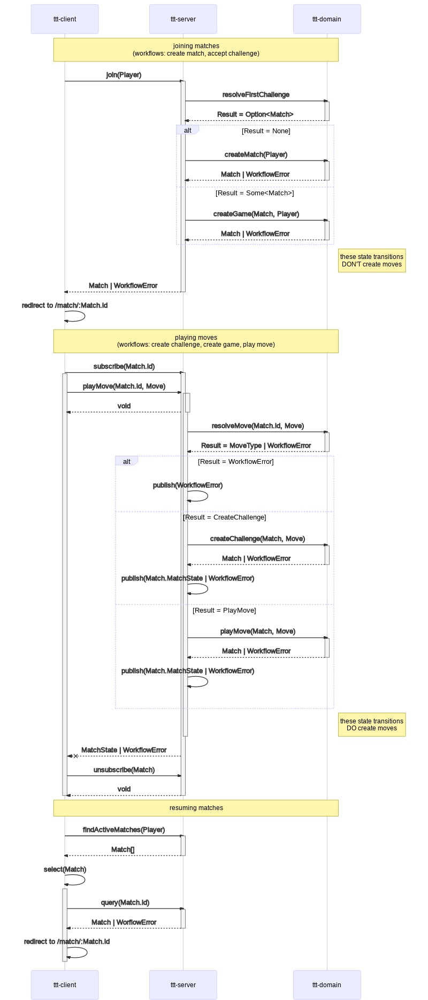

# ttt

## Domain model

- [Domain model](./ttt-domain/src/domain/model.ts)

## Workflows

- [Create match](./ttt-domain/src/workflows/create-match/workflow.ts)
- [Create game](./ttt-domain/src/workflows/create-game/workflow.ts)
- [Create challenge](./ttt-domain/src/workflows/create-challenge/workflow.ts)
- [Accept challenge](./ttt-domain/src/workflows/accept-challenge/workflow.ts)
- [Play move](./ttt-domain/src/workflows/play-move/workflow.ts)
- [Workflow support](./ttt-domain/src/workflows/support.ts)
- [Sequence diagram](./sequence-diagram.md)

## References

- [Harel, David. Statecharts: A visual formalism for complex systems](http://www.inf.ed.ac.uk/teaching/courses/seoc/2004_2005/resources/statecharts.pdf)
- [Wlaschin, Scott. Domain Modelling Made Functional](https://fsharpforfunandprofit.com/books/)
