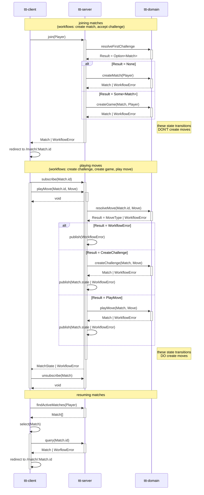

```mermaid
sequenceDiagram
  participant c as ttt-client
  participant s as ttt-server
  participant d as ttt-domain

  note over c,d: joining matches <br />(workflows: create match, accept challenge)

  c->>+s: join(Player)

    s->>+d: resolveFirstChallenge
    d-->>-s: Result = Option<Match>

    alt Result = None
      s->>+d: createMatch(Player)
      d-->>-s: Match | WorkflowError

    else Result = Some<Match>
      s->>+d: createGame(Match, Player)

      d-->>-s: Match | WorkflowError
    end
      note right of d: these state transitions <br /> DON'T create moves

  s-->>-c: Match | WorkflowError

  c->>c: redirect to /match/:Match.id

  note over c,d: playing moves <br />(workflows: create challenge, create game, play move)

  c->>+s: subscribe(Match.id)
  activate c

  c->>+s: playMove(Match.id, Move)
  activate s
  s-->>-c: void

  s->>+d: resolveMove(Match.id, Move)
  d-->>-s: Result = MoveType | WorkflowError


  alt Result = WorkflowError
    s->>s: publish(WorkflowError)

  else Result = CreateChallenge
    s->>+d: createChallenge(Match, Move)
    d-->>-s: Match | WorkflowError
    s->>s: publish(Match.state | WorkflowError)

  else Result = PlayMove
    s->>+d: playMove(Match, Move)
    d-->>-s: Match | WorkflowError
    s->>s: publish(Match.state | WorkflowError)

  end

  note right of d: these state transitions <br /> DO create moves

  deactivate s

  s--xc: MatchState | WorkflowError
  c->>s: unsubscribe(Match)
  s-->>-c: void
  deactivate c

  note over c,d: resuming matches

  c->>+s: findActiveMatches(Player)
  s-->>-c: Match[]

  c->>c: select(Match)
  activate c
  c->>+s: query(Match.id)
  s-->>-c: Match | WorflowError
  c->>c: redirect to /match/:Match.id
  deactivate c
```
