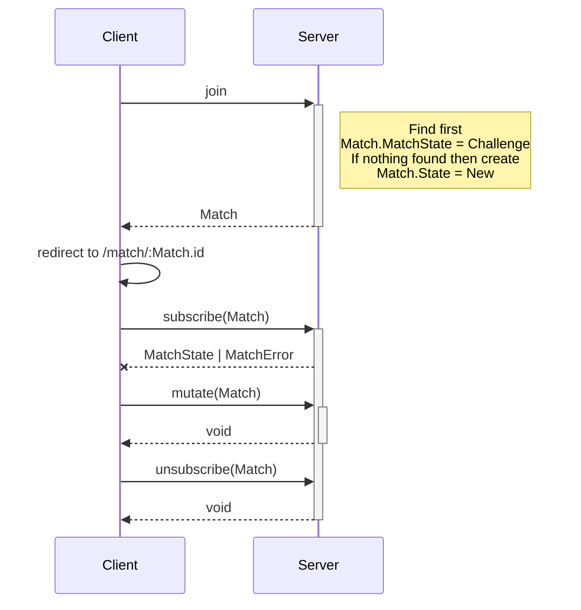

# ttt-server

```mermaid
sequenceDiagram
  participant C as Client
  participant S as Server

  C->>+S: join
  note right of S: Find first <br/>Match.MatchState = Challenge<br/> If nothing found then create<br/>Match.State = New
  S-->>-C: Match

  C->>C: redirect to /match/:Match.id

  C->>+S: subscribe(Match)
  S--xC: MatchState | MatchError

  C->>+S: mutate(Match)
  S-->>-C: void

  C->>S: unsubscribe(Match)
  S-->>-C: void
```
